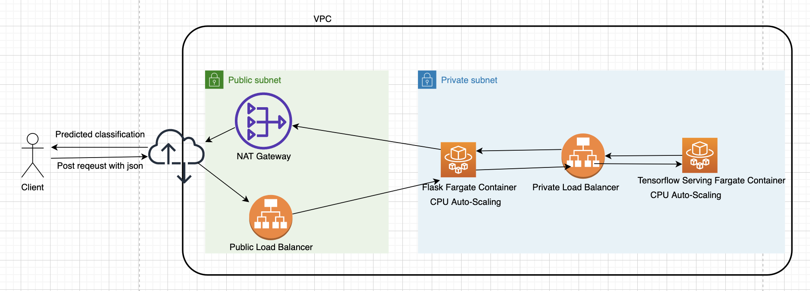
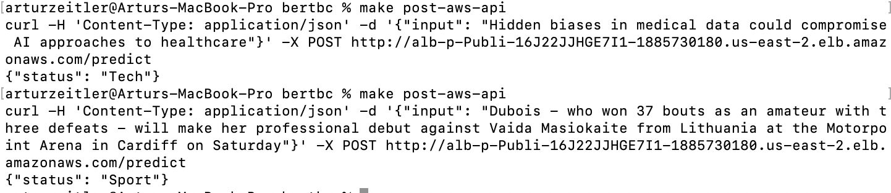

# Classify news with BERT, tensorflow serving, and AWS

## Summary



This repo shows how to use transer learning on a BERT model to classify bbc news. 

A flask API is used to send requests to the tensorflow serving container, and give users are readable response.

The flask api sits behind a public load balancer, while the tensorflow serving container sits behind a private load balancer.

Logs are sent to AWS Cloudwatch

Flask endopints can be tested locally with pytest.

All AWS resources are declared, and deployed declaratively with AWS CloudFormation.

buildspec.yml enables AWS CodeBuild to automatically build new container images after e.g. a new commit is pushed to main.

Since the model is too big be included in the repo, CodeBuild downloads it from S3. However, CodeBuild task execution role requires permission to read the model from S3. buildspec expects a zip file.

Furthermore, CodeBuild task execution role requires the AmazonEC2ContainerRegistryPowerUser policy to interact with ECR.

## Colab Notebook
https://colab.research.google.com/drive/1URSlpijdpmGhWpGeaQallorAJSSWR0DI?usp=sharing

## Two Examples



## Requirements

    Local:
    - docker with docker-compose
    - access to google colab
    - make utility

    Additionally for AWS deployment:
    - AWS account
    - AWS CloudFormation
    - AWS Codebuild

## Building the containers
```
# local
make up-local

# aws
make create-vpc
make create-ecscluster
make create-alb-public
make create-alb-private
make create-api-service
make create-tf-service
```

## Tests
```
make tests
```

## Sending requests to the containers
```
# local
make post-local-api

# aws
make post-aws-api
```

## Deletion of AWS resources
```
make delete-vpc
make delete-ecscluster
make delete-alb
make delete-api-service
make delete-tf-service
make delete-frontend-service
```
